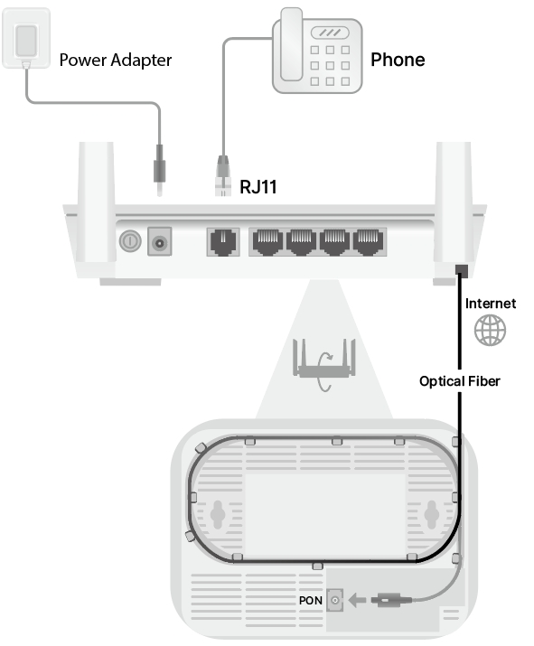

# Connection 

1. Connect the provided power adapter to the Power jack.
2. Connect the telephone to the LAN 1/2/3 port.
3. Connect the Internet to the PON port with an optical fiber.
4. Confirm the connection by checking LEDs: 
    - Power LED and PON LED: Solid on
    - LOS LED: Off
5. Connect your device via Wi-Fi or Ethernet cable.

 Wi-Fi name (SSID) and password are on the router's bottom label.

---