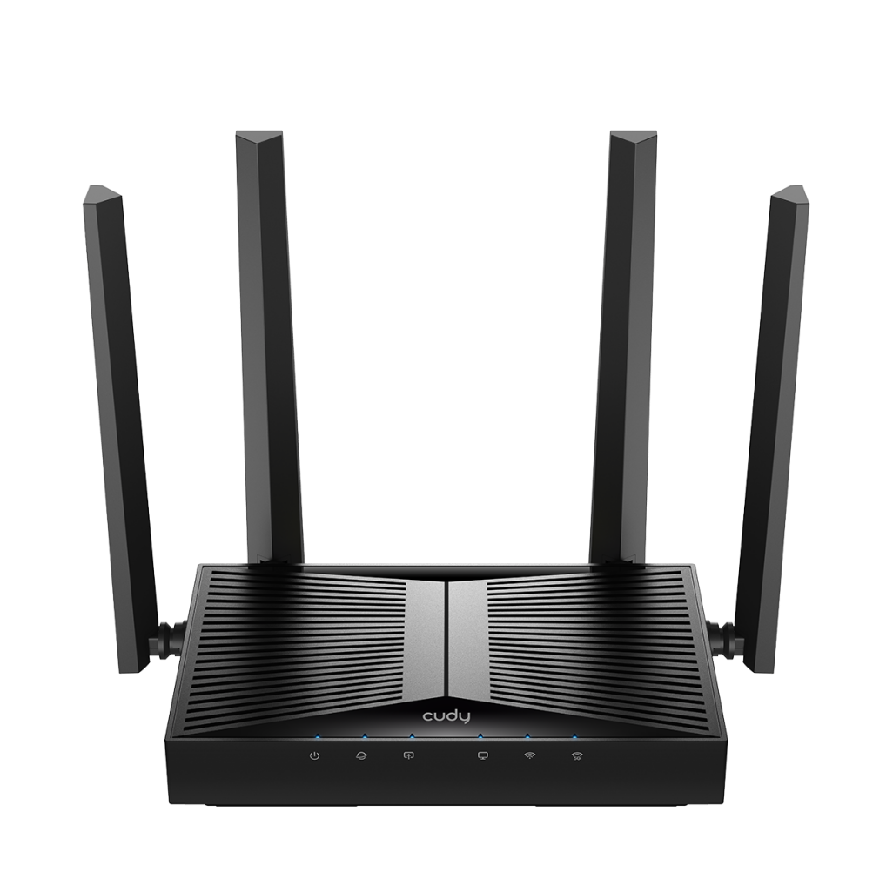

## Front Panel

<table>
    <thead>
    <tr>
    <th>LED</th>
    <th>Status</th>
    <th>Description</th>
    </tr>
    </thead>
<tbody>
    <tr>
    <td rowspan="3" style="text-align: center; vertical-align: middle;">
     (System)</td>
    <td><strong>On</strong></td>
    <td>The system has started up successfully.</td>
    </tr>
    <tr>
    <td><strong>Flash</strong></td>
    <td>The system is starting up or the firmware is being upgraded. Do not disconnect or power off your Router in the process.</td>
    </tr>
    <tr>
    <td><strong>Off</strong></td>
    <td>Power is off.</td>
    </tr>
    <tr>
    <td rowspan="2" style="text-align: center; vertical-align: middle;">
     (Internet)</td>
    <td><strong>On</strong></td>
    <td>Internet service is available.</td>
    </tr>
    <tr>
    <td><strong>Off</strong></td>
    <td>The Router’s Internet port is unplugged or no Internet available.</td>
    </tr>
    <tr>
    <td rowspan="2" style="text-align: center; vertical-align: middle;">     (LAN)</td>
    <td><strong>On</strong></td>
    <td>1~4 powered-on device is connected to the Router’s LAN port.</td>
    </tr>
    <tr>
    <td><strong>Off</strong></td>
    <td>No powered-on device is connected to the Router’s LAN port.</td>
    </tr>
    <tr>
    <td rowspan="2" style="text-align: center; vertical-align: middle;">
     (WAN)</td>
    <td><strong>On</strong></td>
    <td>The Router’s WAN port is connected.</td>
    </tr>
    <tr>
    <td><strong>Off</strong></td>
    <td>The Router’s WAN port is not connected.</td>
    </tr>
    <tr>
    <td rowspan="3" style="text-align: center; vertical-align: middle;">
     (2.4GHz Wireless)</td>
    <td><strong>On</strong></td>
    <td>2.4GHz Wireless Band is enabled.</td>
    </tr>
    <tr>
    <td><strong>Flash</strong></td>
    <td>2.4GHz WPS Connection is in process.</td>
    </tr>
    <tr>
    <td><strong>Off</strong></td>
    <td>2.4GHz Wireless Band is disabled.</td>
    </tr>
    <tr>
    <td rowspan="3" style="text-align: center; vertical-align: middle;">
     (5GHz Wireless)</td>
    <td><strong>On</strong></td>
    <td>5GHz Wireless Band is enabled.</td>
    </tr>
    <tr>
    <td><strong>Flash</strong></td>
    <td>5GHz WPS Connection is in process.</td>
    </tr>
    <tr>
    <td><strong>Off</strong></td>
    <td>5GHz Wireless Band is disabled.</td>
    </tr>
</tbody>
    </table>

## Back Panel

<table>
    <tr>
<th>Interface</th>
<th>Description</th>
    </tr>
    <tr>
<td>ON/OFF Button</td>
<td>Press to turn on/off the PON Router.</td>
    </tr>
    <tr>
<td>Power Jack</td>
<td>Plug the provided power adapter to supply power.</td>
    </tr>
    <tr>
<td>LAN1/2/3 Port</td>
<td>Connect to an Ethernet device.</td>
    </tr>
    <tr>
<td>LAN4/WAN Port</td>
<td>Connect to an Ethernet device or Internet. </td>
    </tr>
    <tr>
<td>WPS Button</td>
<td>Press for 1 second to authorize WPS connection.</td>
    </tr>
    <tr>
<td>WLAN Button</td>
<td>Press for 2 seconds to turn on/off Wi-Fi.</td>
    </tr>
    <tr>
<td>RESET Button</td>
<td>Press for 5 seconds to restore factory defaults.</td>
    </tr>
    <tr>
<td>PON Port</td>
<td>Connect to the Internet with an optical fiber.</td>
    </tr>
</table>

