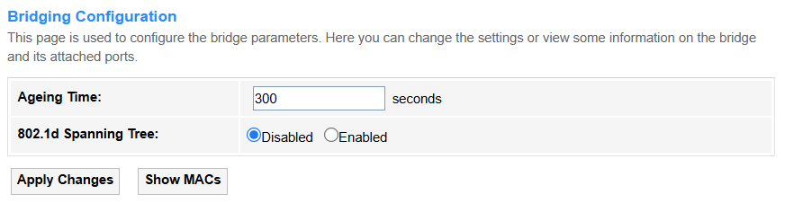
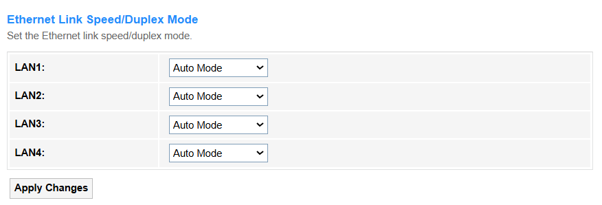
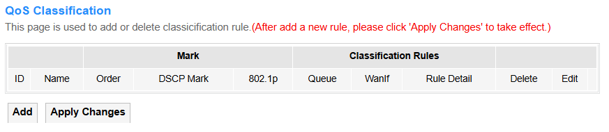
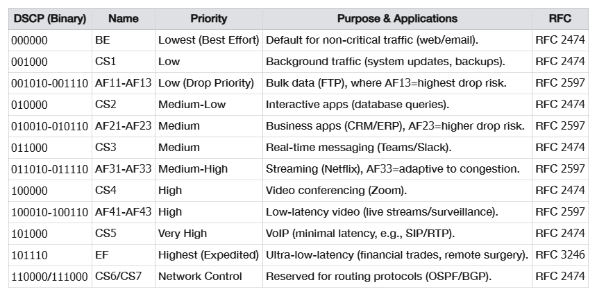
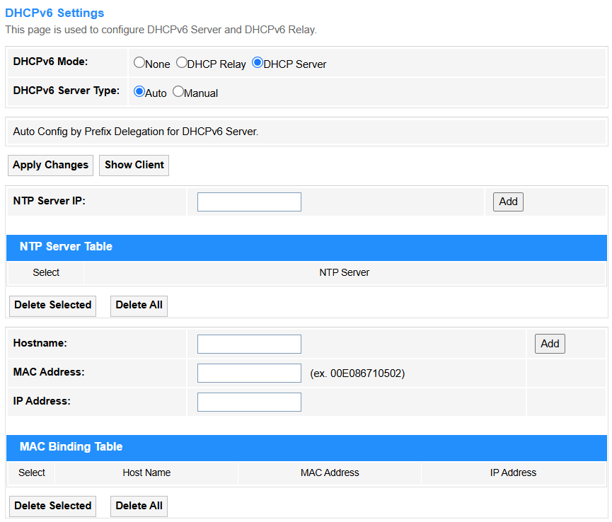
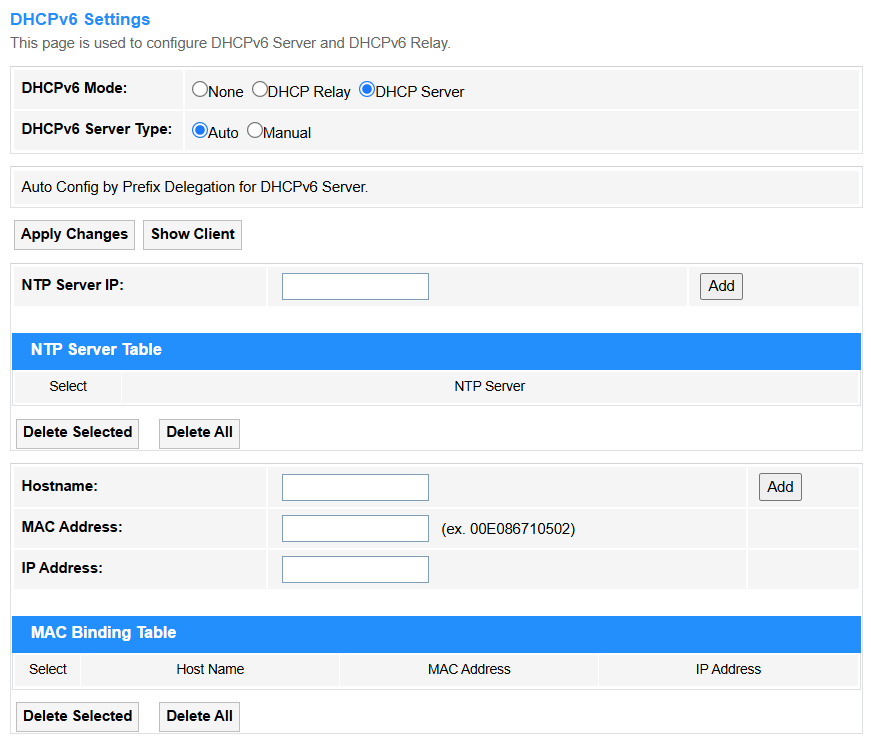
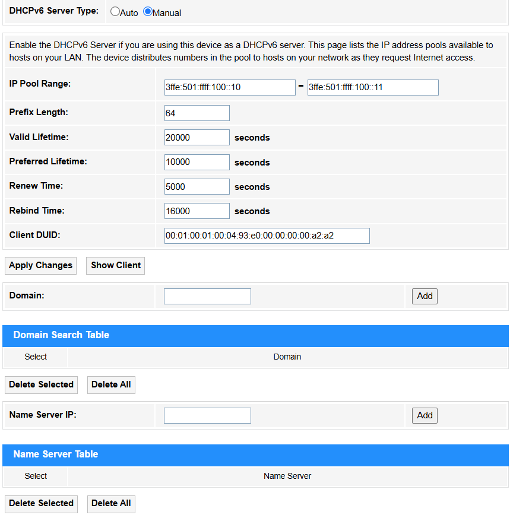

# Advance

## Advance

### ARP Table

ARP (Address Resolution Protocol) is a fundamental networking protocol used to map an IP address to a MAC address (physical hardware address) on a local network.

---
### Bridging

• Aging Time: The duration a bridge retains unused MAC address entries in its forwarding table before discarding them to free up resources. Default value is 300 seconds.

• 802.1d Spanning Tree: A legacy protocol (STP) that prevents network loops by dynamically disabling redundant paths in a bridged/switched network, ensuring a single active path.
For most networks—especially those with redundancy or unknown future changes—keeping STP enabled by default is the safer choice. Disable or replace it only after careful evaluation of risks and alternatives.

*- Apply Changes:* Click to activate all the settings or changes.

*- Show MACs:* Click to view the *Bridge Forwarding Database* with information about Port, MAC Address, Local, Ageing Timer.

---
### Routing

• Enable: Tick to enable the Routing configuration.

• Destination: The target IP address or network where the packet needs to be delivered.

• Subnet Mask: Defines the network portion of an IP address, determining which hosts are local or remote.

• Next Hop: The immediate next router/gateway IP the packet should be forwarded to.

• Metric: A value (e.g., hop count, bandwidth) used to determine the best path to the destination.

• Interface: The physical/logical port through which the packet is sent.

*- Add Route:* Click to add the route configured above into the *Static Route Table*.

*- Update:* Click to update the parameters for the selected route.

*- Delete Selected:* Click to delete the selected route.

*- Show Routes:* Click to view the *IP Route Table* of destination routes commonly accessed by your network.

--- 
### Link Mode

Set the Ethernet Link Speed/Duplex Mode to ensure stable and efficient communication by matching the data rate (e.g.,10/100/1000 Mbps) and transmission direction, both way simultaneously (Full Duplex) or alternately (Half Duplex), between connected devices. Proper settings prevent performance issues like packet loss or speed degradation caused by mismatched parameters. 

• Auto Mode: Automatically selects the highest compatible speed/duplex, reducing manual errors. It is recommended in most cases.

• 10M/100M/1000M Half/Full Mode:. In cases you have to manually set the Mode:

  - Always match settings on both ends (e.g., both 1000M Full Mode).

  - Avoid mismatches: Full Duplex on one end and Half Duplex on the other causes collisions
   
  - Verify with tools: 

    ① Linux: `ethtool <interface>` 

    ② Cisco: `show interfaces status`

    ③ Windows: `netsh interface show interface`, etc.

---
### Print Server

Printer Server on the router enables network-wide printing by sharing a locally connected USB printer, accessible via a web interface (e.g., http://192.168.1.1:631) for setup and management. 

**How to configure:**

1. Connect the printer to the router’s USB port.
2. Enable the print server in the management page.
3. Click *Refresh* to view the updated printer URL(s). 
4. Add the printer to devices using the provided URL.

---
## IP QoS   

### Qos Policy

IP QoS (Quality of Service) is a network technology that prioritizes and manages data traffic to ensure optimal performance for critical applications (e.g., VoIP, video streaming) by controlling bandwidth, latency, and packet loss.

• IP QoS: Select *Enable* to configure the IP QoS.

**- QoS Queue Config**

  - If select *Policy PRIO*, tick *Enable* behind the Queue. The smaller number, the higher priority.
  - If select *Policy WRR*, enter the weight number (default is 40:30:20:10) for the queue and tick *Enable* behind it. 

**- QoS Bandwidth Config**

  - User Defined Bandwidth: If select *Disable*, CPE will select an appropriate bandwidth based on WAN. If select *Enable*, specific bandwidth of WAN needs to be configured.

  - Total Bandwidth Limit: Cap the maximum upload/download speed based on your ISP plan (90% of ISP speed) to ensure critical apps get priority and prevent network congestion.

*- Apply Changes:* Click to activate all the settings or changes.
  
---  
### QoS Classification

*- Add:* Click to configure the QoS Classification rules.

*- Apply Changes:* Click to activate all the settings or changes.

• RuleName: Identifies the rule’s purpose (e.g., VoIP_Priority).

• RuleOrder: Defines evaluation sequence (higher priority rules checked first).

• Precedence: Select Queue priority level for IP packets.

• DSCP Remarking: Select a proper DSCP value. Here is a *DSCP Value Chart* for your referrence.

• 802.1p: Prioritizes VLAN traffic (0-7, e.g., 5 for real-time data).

• IP QoS Rule by type：

  ① Port
  
  • Port/Physical Port: Filters by logical (TCP/UDP) or physical switch port.
  
  • DSCP Pattern: Matches packets with specific DSCP tags (e.g., EF for VoIP).
 
  ② Ethery Type
  
  • Ethernet Type: Filters by Ethernet protocol (e.g., 0x0800 for IPv4).
  
  ③ IP/Protocol
  
  • IP Version: IPv4/IPv6 differentiation.
  
  • Protocol: Matches TCP/UDP/ICMP, etc.
  
  • DSCP Pattern: Matches packets with specific DSCP tags (e.g., EF for VoIP).	
  
  • Source/Destination IP/Mask: Filters by IP ranges (e.g., 192.168.1.0/24).
  
  • Source/Destination Port: Targets specific ports (e.g., 5060 for SIP).
  
  ④ MAC Address
  
  • Source/Destination MAC: Filters by hardware addresses.

*- Apply Changes:* Click to activate all the settings or changes.

---
### Traffic Shaping

*- Add:* Click to configure the IP QoS Traffic Shaping Rule.

*- Apply Changes:* Click to activate all the settings or changes.

• IP Version: Select the IP protocol version used, IPv4 or IPv6.

• Direction: Select the Traffic flow direction,Upstream or Downstream.

• WAN Interface: Select an External network interface.

• LAN Interface: Select a Local network interface. 

• Protocol: Select a transport layer protocol,TCP or UDP, ICMP.
  
**- In IPv4 Version**

• Source IP/Mask: Enter the originating IP address and subnet mask.

• Destination IP/Mask: Enter the target IP address and subnet mask.
  
**- In IPv6 Version**

• Source/Destination IP: Enter the full IPv6 address (e.g., 2001:db8::1 for a single device). Or
use :: to shorten long strings of zeros (e.g., 2001:0db8::1 → 2001:db8::1).

• Source/Destination Prefix Length: Enter a proper prefix length.

  - /128: Matches one exact device (e.g., 2001:db8::1/128).

  - /64: Matches a whole local network (default for home/office).

  - /48 or shorter: For big networks (e.g., ISP ranges).

• Source/Destination Port: Enter the Application ports for filtering.

• Rate Limit: Enter the Bandwidth cap (e.g., 10Mbps) for traffic control.

*- Apply Changes:* Click to activate all the settings or changes.

---

## IPv6   

### IPv6 Enable/Disable

*- IPv6:* Select to *Enable* or *Disable* IPv6 configuration. 

*- Apply Changes:* Click to activate the change.

---
### RADVD

RADVD (Router Advertisement Daemon) is an IPv6 service that broadcasts network prefixes and routing information to hosts, enabling SLAAC  (StateLess Address Auto-Configuration) without DHCPv6. It allows devices to automatically generate IPv6 addresses and discover default gateways via RA (Router Advertisement) messages.

• RADVD: Select *On* to configure *Prefix Mode* and *ULA*. Otherwise select *Off*.

• MaxRtrAdvInterval: Maximum time (in seconds) between Router Advertisement messages sent by the router (default:600s).

• MinRtrAdvInterval: Minimum time (in seconds) between Router Advertisement messages (default:0.33×MaxRtrAdvInterval).

• AdvManagedFlag: Select *On* to indicate DHCPv6 is required for IP addresses (not SLAAC), otherwise select *Off*.

• AdvOtherConfigFlag: Select *On* to tell devices to use DHCPv6 for DNS/other info (even if SLAAC is used for IPs), otherwise select *Off*.

• Prefix Mode: Select the Mode how network prefixes are advertised to devices.

① Auto(SLAAC): The router automatically advertises prefixes, allowing devices to generate their own IPv6 addresses (using Stateless Address Autoconfiguration).For example, devices combine the prefix (2001:db8::/64) with their MAC to create a unique IP.

- RDNSS Mode: Select *HGW Proxy* to manually configure DNS (e.g., custom servers like Cloudflare) and force devices to route DNS queries through the gateway; select *WAN Connection Mode* to automatically advertise the ISP's default DNS servers obtained from the WAN interface (e.g., via PPPoE/DHCPv6).

② Manual: Prefixes are statically configured and advertised without SLAAC. Address assignment relies on DHCPv6 or manual input. For example, in controlled environments where specific prefixes must be enforced.

  - Prefix: Enter the IPv6 network prefix.

  - Prefix Length: Set subnet size (e.g., /64 for a standard LAN).
  
  - AdvValidLifetime: Set the time (seconds) the prefix remains valid (e.g.,86400 = 1 day).
  
  - AdvPreferredLifetime: Set the time (seconds) for SLAAC address preference (e.g., 14400 = 4 hours).
  
  - RDNSS 1/2: Add recursive DNS servers (e.g., 2001:4860:4860::8888 for Google DNS).
  
• Enable ULA: Select *On* for private/internal networks (like IPv4's 192.168.0.0) or backup addressing; select *Off* if you only need global IPv6 (GUA) or avoid NAT-like complexities. 
  
*- Apply Changes:* Click to activate all the settings or changes.

---
### DHCPv6

• DHCP Mode:

① None: DHCP is disabled completely and manual IP configuration is required.

② DHCP Relay: The router forwards DHCP requests across subnets/VLANs (enterprise use, e.g., centralizing DHCP in a data center).

*- Apply Changes:* Click to activate all the settings or changes.

③ DHCP Server: The router assigns IP addresses to clients (default for home networks, manages IP pools/leases).

• DHCPv6 Server Type:

① Auto: The router automatically assigns IPv6 addresses and settings (like DNS) using SLAAC or DHCPv6, typically based on ISP or upstream network configurations.

② Manual: You manually define the IPv6 address range, lease time, DNS servers, and other parameters for full control over DHCPv6 assignments.

• IP Pool Range: Set the range of IPv6 addresses available for DHCPv6 assignment (e.g., 2001:db8::1000 to 2001:db8::2000).

• Prefix Length: Set the subnet mask length (e.g., /64) to define the network portion of assigned addresses.

• Valid Lifetime: Enter the maximum time (seconds) an assigned IPv6 address remains valid (e.g., 86400 = 1 day).

• Preferred Lifetime: Enter the time (seconds) an address stays "preferred" for use before deprecation (e.g., 14400 = 4 hours).

• Renew Time: Enter the time when clients start renewing leases (e.g., 1800 = 30 minutes before expiry).

• Rebind Time: Enter the time when clients seek alternate servers if renewal fails (e.g., 2880 = 48 minutes before expiry).

• Client DUID: Set a unique DHCPv6 client identifier (like a MAC address for IPv6).

• Domain: Set the DNS domain name pushed to clients (e.g., home.lan). Then click *Add* to add the new entry into the *Domain Search Table*.

• Name Server IP: Set the DNS server(s) provided to clients (e.g., 2001:4860:4860::8888). Then click *Add* to add the new entry into the *Name Server Table*.

• NTP Server IP: Enter the IPv4/IPv6 address of a Network Time Protocol (NTP) server used to synchronize device clocks (e.g., 216.239.35.0 for Google NTP). Then click *Add* to add the new entry into the *NTP Server Table*.

• Hostname: Enter a readable label for a device on a network (e.g., router.home).

• MAC Address: Enter a unique 48-bit hardware identifier for network interfaces (e.g., 00:1A:2B:3C:4D:5E).

• IP Address: Enter a numerical label assigned to devices for network communication (e.g., 192.168.1.1 or 2001:db8::1). Then click *Add* to add the new entry into the *MAC Binding Table*.

*- Apply Changes:* Click to activate all the settings or changes.

*- Show Clients:* Click to view all the *Active DHCPv6 Clients* with the assigned IP address, DUID and expired time for each DHCP leased client.

*- Delete Selected:* Click to delete the selected entries in the table. 

*- Delete All:* Click to delete all the entries in the table. 

----
### MLD Proxy

It is a protocol that forwards Multicast Listener Discovery (MLD) messages between IPv6 networks, enabling multicast routing without full PIM-SM support. It acts as a simple relay for multicast group memberships across subnet boundaries.

• Robust Count: Set the number of times IGMP/MLD queries are sent to ensure group membership stability (e.g., 2 for redundancy).

• Query Interval: Set the time (seconds) between general IGMP/MLD membership queries (e.g., 125).

• Query Response Interval: Set the maximum delay for hosts to respond to queries (e.g., 2000ms).

• Response Interval of Last Group Member: Set the delay (seconds) for final leave-group messages (e.g., 1 to reduce latency,2 for better reliability).

*- Apply Changes:* Click to activate all the settings or changes.

---
### MLD Snooping

It is a Layer 2 optimization technique where switches listen to MLD (Multicast Listener Discovery) messages to intelligently forward IPv6 multicast traffic only to ports with interested receivers, reducing unnecessary network flooding.

• Enable: Select it when you need efficient IPv6 multicast traffic delivery within a VLAN (e.g., video streaming networks). 

• Disable: Select it if all ports require broadcast-like multicast flooding (e.g., testing environments) or to reduce switch processing load.

*- Apply Changes:* Click to activate all the settings or changes.

---

### IPv6 Routing

It manually configures fixed paths for network traffic by specifying destination prefixes and next-hop addresses, ideal for small or stable networks. Use it when routes rarely change, but avoid in large/dynamic networks due to lack of automatic updates.

• Enable: Tick to turn on the static route.

• Destination: Enter the target IPv6 network prefix (e.g., 2001:db8::/64).

• Next Hop: Enter the adjacent router's IPv6 address for forwarding (e.g., fe80::1).

• Metric: Enter the Route priority used if multiple paths exist. 1 stands for that the route is preferred as the primary path due to its lower cost; while 2 means that it acts as a backup/secondary route and is used only when the primary (Metric=1) fails.

• Interface: Physical/Virtual port for sending traffic (e.g., GigabitEthernet0/1).

*- Add Route:* Click to add the route configured above into the *IPv6 Static Route Table*.

*- Update:* Click to update the parameters for the selected route.

*- Delete Selected:* Click to delete the selected route.

*- Delete All:* Click to delete all the routes.

*- Show Routes:* Click to view the *IP Route Table* of destination routes commonly accessed by your network.

----

### IP/Port Filtering

  It controls network access by blocking/allowing specific IPv6 addresses and port numbers, enhancing security (e.g., deny 2001:db8::1 port 22). It operates at firewall or router levels to restrict unauthorized traffic.

• Outgoing Default Action: Select the default behavior for outgoing traffic. *Allow* for open environments where most traffic is trusted (e.g., home networks), while *Deny* for strict security to block all traffic unless explicitly permitted (e.g., corporate firewalls).

• Incoming Default Action: Select the default handling of incoming traffic. *Allow* for open networks where most incoming traffic is trusted (e.g., internal collaboration tools), while *Deny* for strict security to block all inbound traffic unless explicitly permitted (e.g., public-facing servers).

• Direction: Select the traffic flow for rule application. *Incoming* to control external-to-internal traffic (e.g., blocking attacks), while *Outgoing* to restrict internal-to-external flows (e.g., preventing data leaks).

• Protocol: Select a filter by transport layer protocol. *TCP* for reliable connection-based data (e.g., web browsing), *UDP* for low-latency connectionless traffic (e.g., video streaming), while *ICMPv6* for network diagnostics (e.g., ping, MTU discovery).

• Rule Action: Select Action to take if the rule matches (Permit or Block). *Allow* to explicitly permit matched traffic (e.g., whitelisting trusted services), while *Deny* to block specific threats or unwanted flows (e.g., blacklisting malicious IPs).

• Source IP Address: Enter a specific IPv6 address (e.g., 2001:db8::1) where the traffic to be filtered originates from.

• Source Prefix Length: Specifies the IPv6 subnet mask length (e.g., /64) for the source IPv6 address range, determining how broadly (e.g., entire network) or narrowly (e.g., single host) the rule applies.

• Destination IP Address: Enter a specific IPv6 address to send the target traffic to (e.g., ff02::1 for multicast).

• Destination Prefix Length: Defines the IPv6 subnet mask (e.g., /64) for the target network, controlling whether the rule applies to a single host (/128), a subnet, or broader ranges.

• Source Port: Enter the sender’s port for the filtered traffic (e.g., 1024 for custom apps).

• Destination Port: Enter the receiver’s port for the filtered traffic (e.g., 80 for HTTP).

*- Apply Changes:* Click to activate the change.

*- Add:* Click to add the new entry into the *Current Filter Table*.

*- Delete Selected:* Click to delete the selected entries.

*- Delete All:* Click to delete all the entries in the table. 

---
### IPv6 ACL

IPv6 ACL (Access Control List) filters network traffic by defining permit/deny rules based on IPv6 addresses, ports, or protocols to enforce security policies.

• IPv6 ACL Capability: Select *Enable* when you need granular traffic control (e.g., security filtering); select *Disable* if no traffic restrictions are required to reduce device processing overhead.

• Interface: Select the physical/virtual port for applying the rule. *WAN* for rules filtering external/internet-facing traffic (e.g., blocking inbound attacks), while *LAN* for internal network controls (e.g., restricting inter-VLAN access).

• Source IP Address: Set Source IP Address to specify the exact IPv6 host (2001:db8::1) or network range (2001:db8::/64) for traffic filtering, ensuring precise control over allowed/blocked sources.

• Source Prefix Length: Set Source Prefix Length to define the scope of source IPv6 addresses (e.g., /64 for a subnet, /128 for a single host), balancing specificity and flexibility in traffic filtering.

• Service: Defines rules to filter traffic for specific protocols (e.g., FTP, HTTP, ICMPv6) by matching ports (TCP/UDP) or ICMPv6 types (e.g., PING uses types 128/129).

  - Any: Select it only for broad rules (e.g., testing, default deny) but avoid it in strict security policies. It indicates a wildcard that matches all addresses (::/0) and ports (if unspecified).

  - FTP: File transfer protocol (TCP ports 20/21); select it for secure internal file transfers with authentication.

  - TFTP: Trivial FTP (UDP port 69); select it for simple, fast transfers in local networks (e.g., device configs).

  - HTTP: Web data protocol (TCP 80); select it for unencrypted web traffic (avoid on sensitive sites).

  - HTTPS: Secure HTTP (TCP 443); always prefer for encrypted web access (e.g., logins, payments).

  - PING: Network diagnostic tool (ICMPv6 types 128/129); select it to test connectivity, but block in strict ACLs for security.

*- Add:* Click to add the new entry into the *Current ACL Table*.

*- Delete Selected:* Click to delete the selected entries.

---