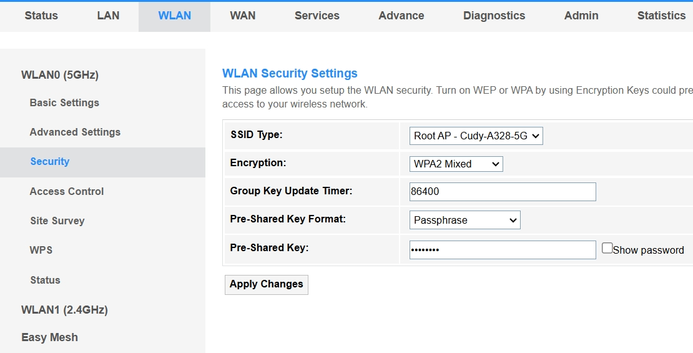

# Quick Setup

1. Launch a web browser on the device connected.
2. Enter *cudy.net* or *192.168.1.1* in the address bar.
3. Create an adminstrator password to log in.
4. Go to *WLAN* -> *Security* to configure the parameters, and click *Apply Changes*.
   
---