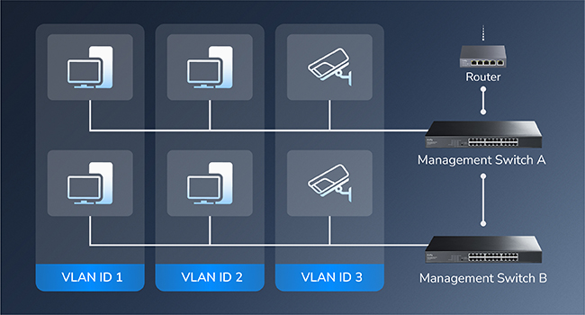

# GS1024E

## Overview
<!DOCTYPE html>
<html lang="en">
<head>
    <meta charset="UTF-8">
    <meta name="viewport" content="width=device-width, initial-scale=1.0">
    <title>Tab切换示例</title>
    
</head>

<body>
    <!-- 标签容器 -->
    

        
Package Content

        
Appearance

        
Topology

        
LED & DIP
   
    

    <!-- 内容面板容器 -->
    

        

            

        

        

            

            
&nbsp;
 
            
&nbsp;

            
&nbsp;

            

        

        

            

            
&nbsp;
 
            

        

        

            <table>
                <tr>
                    <th>LED</th>
                    <th>Description</th>
                </tr>
                <tr>
                    <td>PWR</td>
                    <td>
                    
On: Power is on.

                    
Off: Power is off.

                    </td>
                </tr>
                <tr>
                    <td>
                    
Link/Act

                    
(1-24)

                    </td>
                    <td>
                    
On: Link but no data.

                    
Flash: Link and data transmission. 

                    
Off: No link or no data.

                    </td>
                </tr>
                <tr>
                    <th>DIP</th>
                    <th>Description</th>
                </tr>
                <tr>
                    <td>Managed</td>
                    <td>(Default) Light-managed Mode. Allow to manage the swicth on the web-based GUI.</td>
                </tr>
                <tr>
                    <td>VLAN</td>
                    <td>Non-managed Mode. The designated Downlink Port 1-22 are isolated from each other, and only transmit data with the Uplink Port 23-24.</td>
                </tr>
                <tr>
                    <td>Extend</td>
                    <td>Non-managed Mode. The data speed of Port 1-22 will be capped at 10 Mbps and the maximum transmission distance be 250 meters.</td>
                </tr>
                <tr>
                    <td>RESET</td>
                    <td>Toggle the switch from left to right and back within 2 seconds to restore the factory defaults.</td>
                </tr>
            </table>
        
      
    

    
</body>
</html>

---
## [Installation](installation.md)

The switch supports two means of installation: [Desktop](installation.md#desktop-installation) and [Rackmount via brackets](installation.md#rack-installation). [>>> >>>](installation.md)

---

## Management

### - [Login](log_in_out.md)
The switch supports further management on the GUI web page. Log into it and start management.
[>>> >>>](log_in_out.md)

---
### - [System Manage](system_manage.md)

- [**System Info**](system_manage.md#system-info) displays the system information about the switch, including System name, MAC address, IP address, Firmware version and so on. [>>> >>>](system_manage.md#system-info)
- [**IP Settings**](system_manage.md#ip-settings) displays the IP address and subnet mask or allows for alteration. [>>> >>>](system_manage.md#system-info)
- [**Account Settings**](system_manage.md#account-settings) allows to change the login account username or password.[>>> >>>](system_manage.md#system-info)

---
### - [Port Management](port_management.md)

- [**Port Settings**](port_management.md#port-settings) configures the Ports' parameters, including the state, auto-negotiation, data transfer rate and mode, as well as the flow control. [>>> >>>](port_management.md#port-settings)

- [**Port Trunk**](port_management.md#port-trunk) allows multiple ports to be bundled together to increase bandwidth and provide redundancy data for transmission. [>>> >>>](port_management.md#port-trunk)

- [**Port Mirror**](port_management.md#port-mirror) enables the traffic of one port to be copied to another port for monitoring and analysis purposes. [>>> >>>](port_management.md#port-mirror)

- [**Speed Limit**](port_management.md#speed-limit) restricts the data transmission rate of a port to prevent network congestion and ensure fair bandwidth allocation. [>>> >>>](port_management.md#speed-limit)

- [**Jumbo Frame**](port_management.md#jumbo-frame) supports the transmission of larger data frames (typically up to 9,000 bytes) to improve network efficiency and reduce overhead. [>>> >>>](port_management.md#jumbo-frame)

- [**EEE Config**](port_management.md#eee-config)(Energy-Efficient Ethernet configuration) allows the switch to reduce power consumption during periods of low data activity while maintaining network connectivity. [>>> >>>](port_management.md#eee-config)

- [**Storm Control**](port_management.md#storm-control) limits the number of broadcast, multicast, or unknown unicast frames on a port to prevent network storms that can overwhelm the network. [>>> >>>](port_management.md#storm-control)

- [**Traffic Monitor**](port_management.md#traffic-monitor) monitors network traffic to identify patterns, detect anomalies, and provide insights into network performance and usage. [>>> >>>](port_management.md#traffic-monitor)

- [**MAC Manage**](port_management.md#mac-manage) manages MAC addresses by learning, filtering, and controlling access based on MAC addresses to enhance network security and manageability. [>>> >>>](port_management.md#mac-manage)

----

### - [Protocol Management](protocol_management.md) 

- [**SNMP**](protocol_management.md#snmp) is a widely used protocol for managing and monitoring network devices. It allows network administrators to collect information from and configure devices such as routers, switches, and servers. [>>> >>>](protocol_management.md#snmp)

- [**IGMP Snooping**](protocol_management.md#igmp) is a technique used by switches to monitor IGMP messages between hosts and routers. It helps optimize multicast traffic by ensuring that multicast packets are only forwarded to ports where interested receivers are present. [>>> >>>](protocol_management.md#igmp)

- [**DHCP Snooping**](protocol_management.md#dhcp-snooping) is a security feature used on switches to prevent unauthorized DHCP servers from assigning IP addresses to devices on the network. It helps protect against IP address spoofing and ensures that only legitimate DHCP servers can operate. [>>> >>>](protocol_management.md#dhcp-snooping)

- [**Loop Prevention**](protocol_management.md#loop-prevention) is used in networks to avoid the creation of loops that can cause broadcast storms and network instability. Techniques such as Spanning Tree Protocol (STP) are commonly used to detect and prevent loops in Layer 2 networks. [>>> >>>](protocol_management.md#loop-prevention)

- [**Spanning Tree**](protocol_management.md#spanning-tree) (STP) is a network protocol that prevents loops in a network by ensuring that there is only one active path between any two network devices. It achieves this by creating a loop-free topology using a tree structure. [>>> >>>](protocol_management.md#spanning-tree)
  
- [**LLDP Config**](protocol_management.md#lldp-config) is a protocol used to exchange information between adjacent network devices. It helps in discovering device information, such as device type, port details, and VLAN information, which can be useful for network management and troubleshooting. [>>> >>>](protocol_management.md#lldp-config)

- [**LLDP Neighbor**](protocol_management.md#lldp-neighbor) displays information about adjacent devices discovered via LLDP. [>>> >>>](protocol_management.md#lldp-neighbor)

---

### - [VLAN](vlan.md)

- [**MTU VLAN**](vlan.md#mtu-vlan) adjusts the Maximum Transmission Unit (MTU) size (typically to 1496 bytes) on interfaces carrying VLAN-tagged traffic to accommodate the extra 4-byte 802.1Q tag and prevent fragmentation or packet loss. [>>> >>>](vlan.md#mtu-vlan)

- [**Port-based VLAN**](vlan.md#port-based-vlan) also called Static VLAN, assigns switch ports directly to a specific VLAN; any device plugged into that port belongs to that VLAN. Ideal for simplicity and static device locations. [>>> >>>](vlan.md#port-based-vlan)

- [**802.1Q VLAN**](vlan.md#8021q-vlan) also called Tagged VLAN/Trunking, uses standard 802.1Q tags within Ethernet frames to identify VLAN membership, allowing a single physical link (trunk) to carry traffic for multiple VLANs between switches or to routers. [>>> >>>](vlan.md#8021q-vlan)

- [**Voice VLAN**](vlan.md#voice-vlan) is a dedicated VLAN specifically for IP phone traffic, often prioritizing it (via QoS) and separating it from data traffic for better quality and security. Typically uses 802.1Q tagging 3. [>>> >>>](vlan.md#voice-vlan)

---

### - [QoS](qos.md)

- [**QoS Basic**](qos.md#qos-basic) includes SP, WRR and WFQ. For more configurations, please go to [>>> >>>](qos.md#qos-basic)

- [**QoS Advanced**](qos.md#qos-advanced) includes Port_based QoS, 802.1q_based Qos and DSCP_based QoS. For more configurations, please go to [>>> >>>](qos.md#qos-advanced)

---

### - [Tools](tools.md)
- [**Cable Diagnostics**](tools.md#cable-diagnostics) supports to test and assess the condition of the cables connected to specific ports. [>>> >>>](tools.md#cable-diagnostics)

- [**Firmware Upgrade**](tools.md#firmware-upgrade) updates the switch to its latest firmware, enhancing functionality, fixing bugs, or improving security. [>>> >>>](tools.md#firmware-upgrade)

- [**Ping Tool**](tools.md#ping-tool) tests connectivity to another device by sending ICMP echo requests and measuring the response time. [>>> >>>](tools.md#ping-tool)

- [**Backup Restore**](tools.md#backup-restore) saves or retrieves switch configuration settings, allowing you to back up current settings or restore previous ones. [>>> >>>](tools.md#backup-restore)

- [**System Reset**](tools.md#system-reset) resets the switch to its factory default settings, erasing all custom configurations. [>>> >>>](tools.md#system-reset)

- [**System Reboot**](tools.md#system-reboot) restarts the switch, reloading the current firmware and configuration without erasing settings. [>>> >>>](tools.md#system-reboot)
  
---