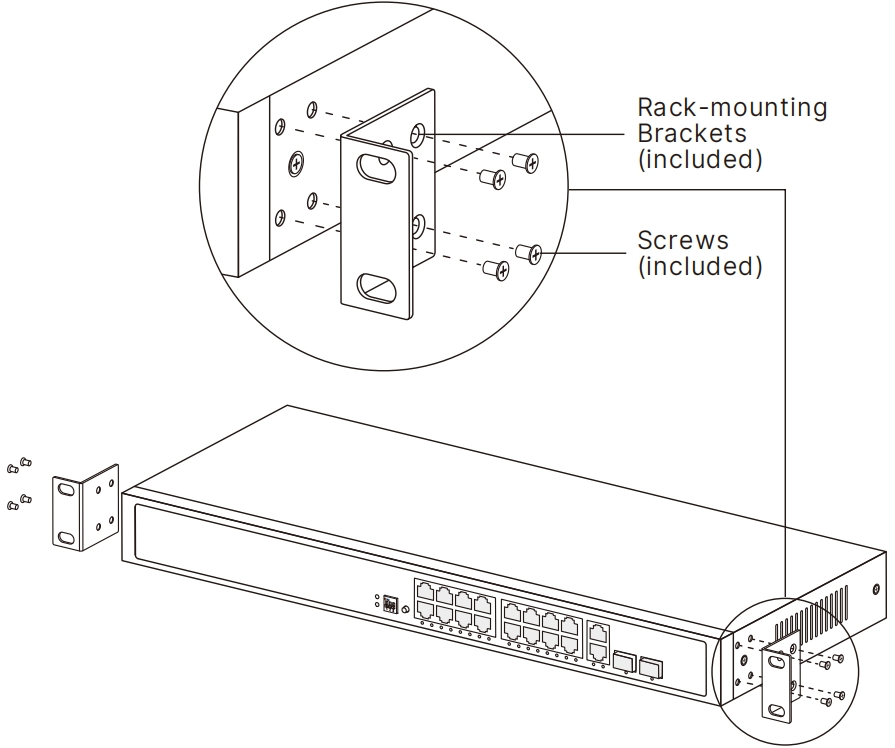
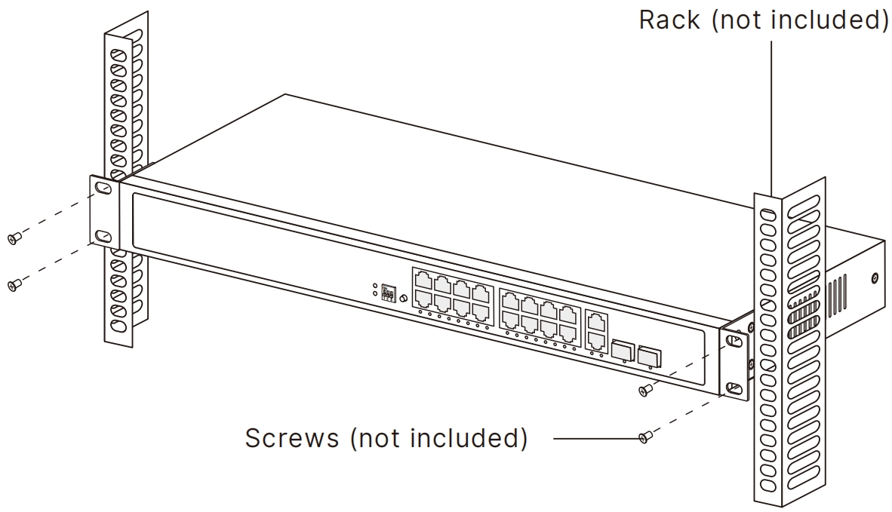
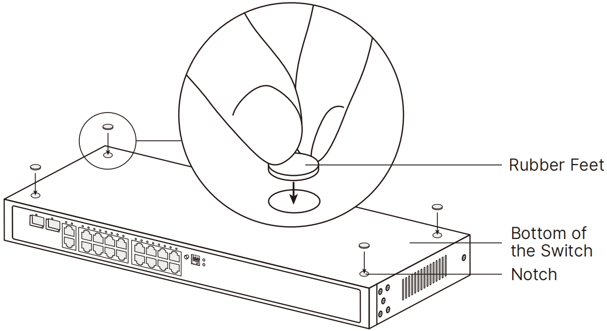

# Installation

 GS1018PS2 is for illustration below. Your actual product may differ.

## Rack Installation

To install the switch in an EIA standard-sized 19-inch rack, follow the steps below:

1. Check the efficiency of the grounding system and the stability of the rack.
2. Secure the rack-mounting brackets to the Switch with screws, as illustrated below.

3. Secure the brackets to the rack with suitable screws, as illustrated below.

- Leave 5 to 10 cm gaps around the devices for air circulation.
- Avoid placing heavy things on the device.
- Mount devices in sequence from the bottom to top of the rack and ensure a certain clearance between devices for the purpose of heat dissipation.

----
## Desktop Installation

To install the switch on the desk, follow the steps below:

1. Place the switch on a flat surface, which is strong enough to support the entire weight of the device with all fittings.
2. Remove the adhesive backing papers from the rubber feet.
3. Attach the rubber feet to the bottom of the device to prevent it from slipping when placed on a desktop.
