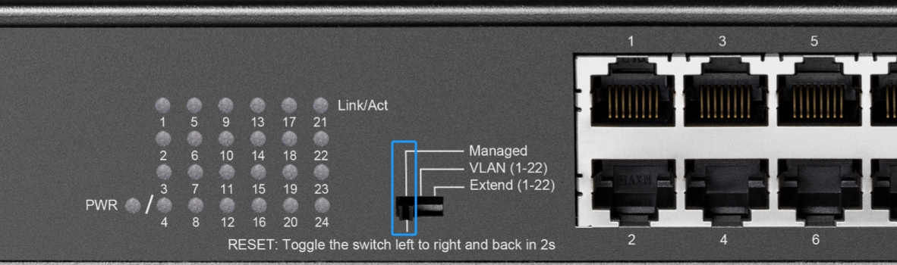
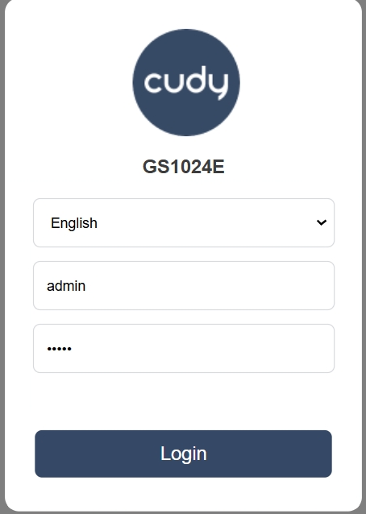
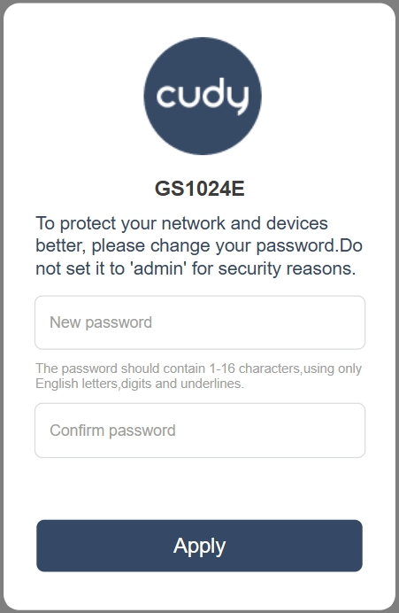
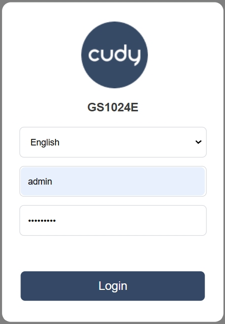
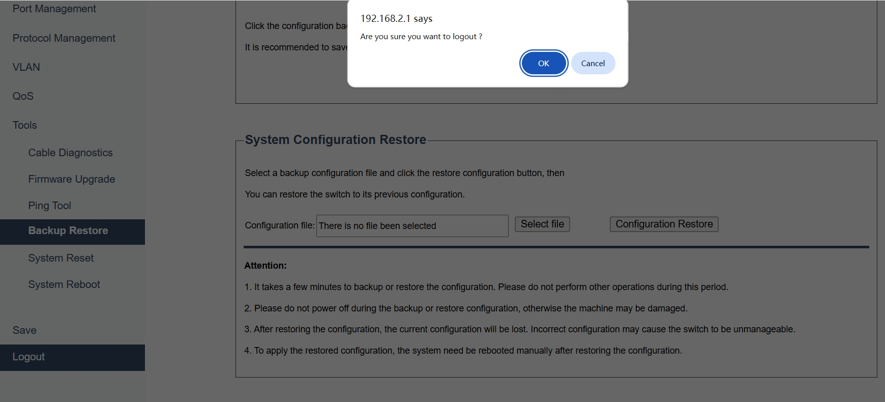

## Login
The switch supports further management on the GUI web page. Log into it and start management.

1. Make sure the DlP switch is on Managed.  
    

2. Set your PC's IP address to 192.168.2.x (xranges from 2 to 254) and subnet mask to 255.255.255.0.
   
3. Launch a web browser on your PC, enter *192.168.2.1* in the address bar and press *Enter*.

4. Enter **admin** as both username and password for the initial login. Create your own password as suggested and click *Apply*. Login again with your new password.
     --->   ---> 
---

## Logout
To securely end the current management and ensure that no unauthorized access can occur until a new login is performed. This feature helps protect the switch configuration and management settings from potential security breaches.

