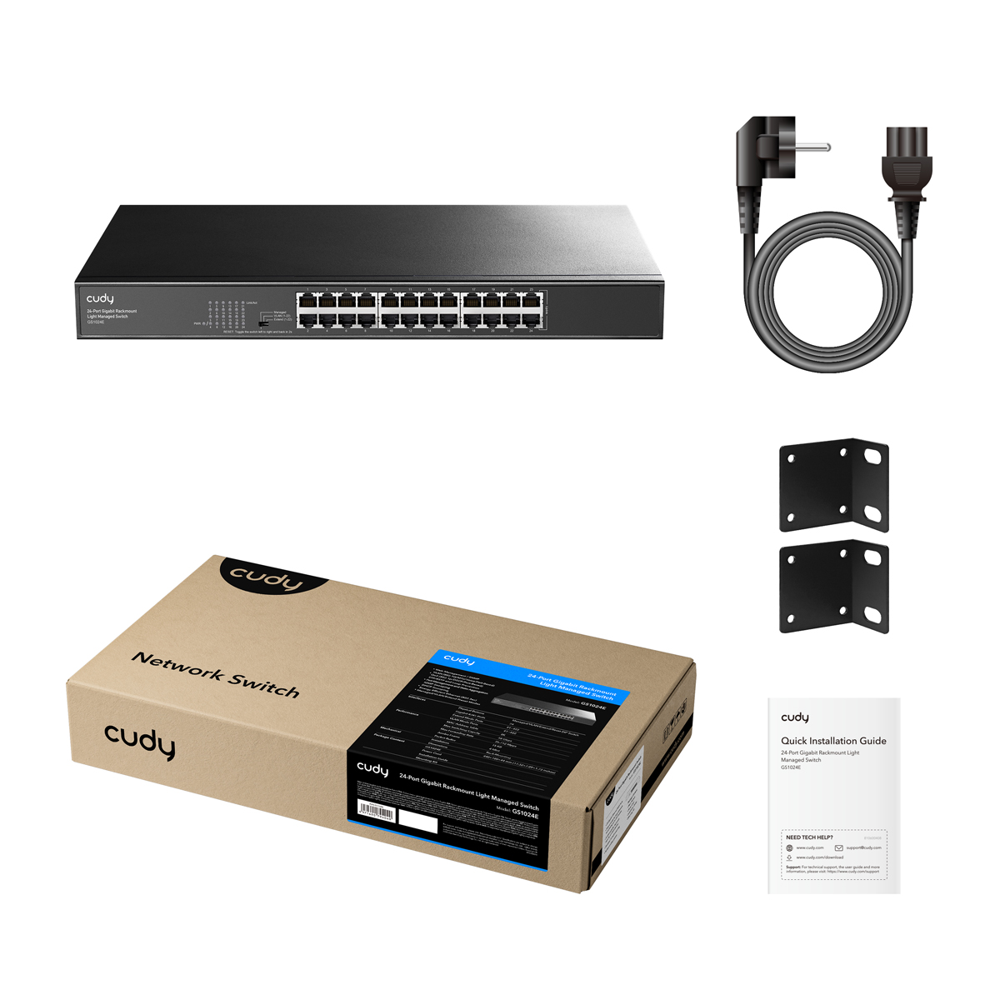
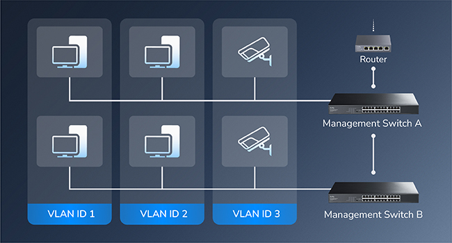

# Overview
## Package Content

---

## Appearance

## LED & DIP
<table>
    <tr>
        <th>LED</th>
        <th>Description</th>
    </tr>
    <tr>
        <td>PWR</td>
        <td>
        
On: Power is on.

        
Off: Power is off.

        </td>
    </tr>
    <tr>
        <td>
        
Link/Act

        
(1-24)

        </td>
        <td>
        
On: Link but no data.

        
Flash: Link and data transmission. 

        
Off: No link or no data.

        </td>
    </tr>
    <tr>
        <td><b>DIP</b></td>
        <td><b>Description</b></td>
    </tr>
    <tr>
        <td>Managed</td>
        <td>(Default) Light-managed Mode. Allow to manage the swicth on the web-based GUI.</td>
    </tr>
    <tr>
        <td>VLAN</td>
        <td>Non-managed Mode. The designated Downlink Port 1-22 are isolated from each other, and only transmit data with the Uplink Port 23-24.</td>
    </tr>
    <tr>
        <td>Extend</td>
        <td>Non-managed Mode. The data speed of Port 1-22 will be capped at 10 Mbps and the maximum transmission distance be 250 meters.</td>
    </tr>
    <tr>
        <td>RESET</td>
        <td>Toggle the switch from left to right and back within 2 seconds to restore the factory defaults.</td>
    </tr>
</table>
---

## Topology

