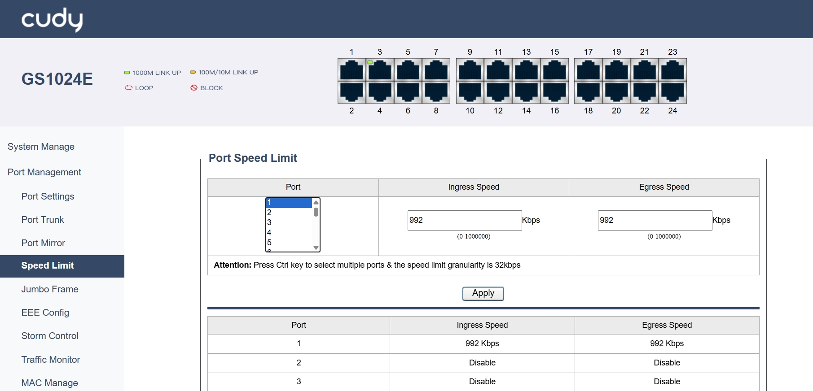
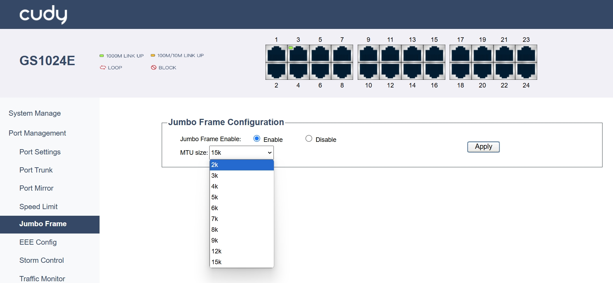

# Port Management

## Port Settings

- Port: Specifies the physical port on the switch.
- State: Select the port state to be Enabled or Disabled.
- Automatic: Turn On or Off the auto-negotiation for the port.
- Rate: Select the data transfer rate and mode (half or full duplex) for the port.
- Flow Control: Turn On or Off the flow control to manage data transmission.
  
*- Apply:* Click to save and apply your changes or settings.

---

## Port Trunk

- Trunk Group: Select a group of ports that can be managed as a single logical link.
- Member Port: Specify the ports that are part of the trunk group.

*- Apply:* Click to save and apply your changes or settings.

*- Select All:* Click to select all the entries.

*- Delete:* Click to delete the selected entries.

---

## Port Mirror

- Session: Identify a specific mirroring session.
- Port Mirror: Select to Disable or Enable the Port Mirror.
- Mirroring Port: Specify the port that will receive mirrored traffic.
- Mirrored Port: Specify the port whose traffic will be mirrored.
- Ingress: Select to Disable or Enable the mirrors incoming traffic.
- Egress: Select to Disable or Enable the mirrors outgoing traffic.

---

## Speed Limit

- Port: Specify the port to apply speed limits to.
- Ingress Speed: Sets the maximum incoming data rate for the port.
- Egress Speed: Sets the maximum outgoing data rate for the port.
  
*- Apply:* Click to save and apply your changes or settings.

---

## Jumbo Frame

- Jumbo Frame Enable: Select to Enable or Disable jumbo frame support.
- MTU Size: Set the maximum transmission unit size for jumbo frames. Bigger MTUs enhance throughput but need compatible devices and careful management to avoid issues.
  
*- Apply:* Click to save and apply your changes or settings.

---

## EEE Config

- EEE State: Select to Enable or Disable the Energy-Efficient Ethernet (EEE) state to manage power consumption.
  
*- Apply:* Click to save and apply your changes or settings.

---

## Storm Control

Storm Suppression manages traffic storms by limiting the rate of unknown unicast, multicast, and broadcast packets.

- Port: Specify the port to apply storm control to.
- State: Enable or Disable storm control.
- Speed: Set the speed at which packets are suppressed.
- Unknown Unicast Packets: Limit the rate of unknown unicast packets.
- Multicast Packets: Limit the rate of multicast packets.
- Broadcast Packets: Limit the rate of broadcast packets.

*- Apply:* Click to save and apply your changes or settings.

---

## Traffic Monitor

- Port: Displays the port being monitored.
- Tx bytes: Displays the number of transmitted bytes.
- Rx bytes: Displays the number of received bytes.
- Tx pkts: Displays the number of transmitted packets.
- Rx pkts: Displays the number of received packets.

*- Clear:* Click to empty the traffic data in the table.

---

## MAC Manage

- Port Index: Identify the port for MAC address management.
- Maximum MAC number: Set the maximum number of MAC addresses allowed on the port. 0 means disabled.
- VID: Specifies the VLAN ID.
- MAC address: Enter the MAC addresses associated with the port.
- Dynamic MAC Address Table: Displays the dynamic MAC address table with index, VLAN ID, MAC address, and port information.
- Aging time: Indicates the aging time for dynamic MAC addresses.

*- Apply:* Click to save and apply your changes or settings.

*- Add:* Click to add a new MAC address entry.

*- Delete:* Click to delete an existing MAC address entry.
