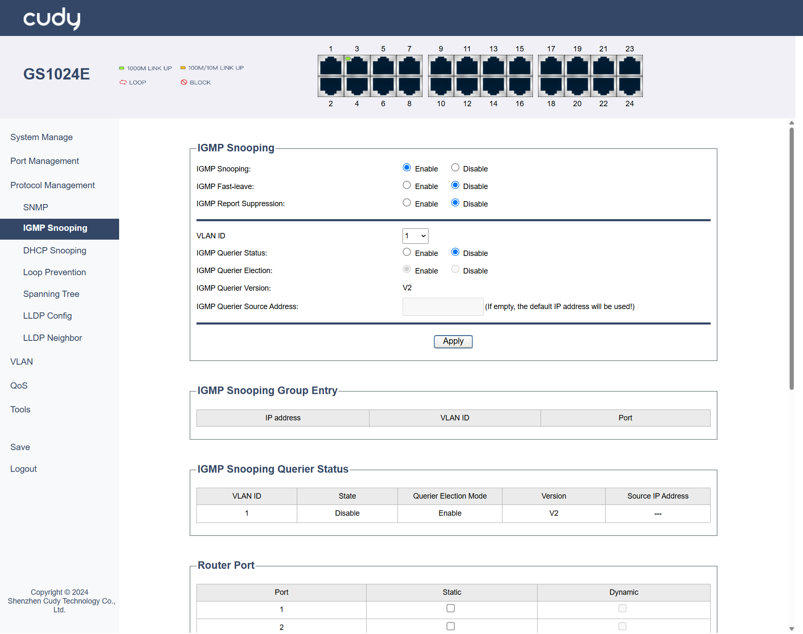
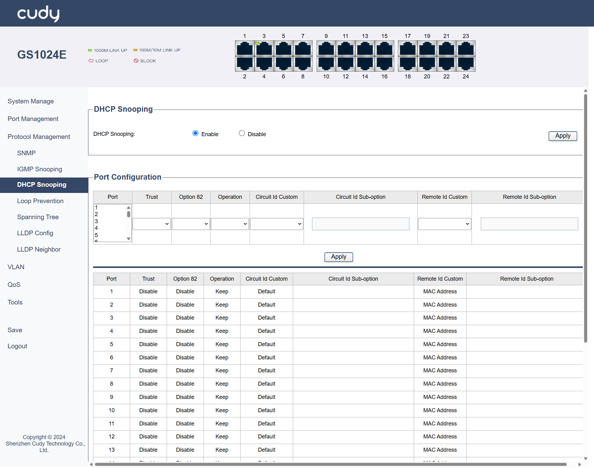

# Protocol Management

## SNMP
SNMP is a widely used protocol for managing and monitoring network devices. It allows network administrators to collect information from and configure devices such as routers, switches, and servers.

**Version**

- SNMP v1: Select to Enable or Disable it. It is the first version of the Simple Network Management Protocol (SNMP), providing basic functionality for network management but with limited security features.
- SNMP v2c: Select to Enable or Disable it. It is an enhanced version of SNMP that improves upon v1 with better bulk data retrieval and improved error handling, though it still lacks strong security mechanisms.

**Communities**

- read community: A community string used by SNMP agents to allow read-only access to managed devices, enabling monitoring but not configuration changes. Select it to be Public or Private.
- write community: A community string that grants read-write access, allowing both monitoring and configuration changes to managed devices. Select it to be Public or Private.
- trap community: A community string used for sending SNMP trap messages, which are asynchronous notifications from agents to managers about significant events. Select it to be Public or Private.
  
**Trap**

- SNMP v1 trap: Select to Enable or Disable it. It is an SNMP v1 message sent by an agent to a manager to report significant events, such as errors or status changes.
- SNMP v2c trap: Select to Enable or Disable it. It is an SNMP v2c message that provides enhanced trap functionality, including better error handling and bulk data transfer capabilities compared to SNMP v1 traps.
- Trap Server: Select to specify the destination for trap messages, either By name (hostname) or By IP (address), where the SNMP manager listens for traps.
- Trap type: Select a type of traps that indicate specific events, such as a device reboot (cold/warm start), a network link becoming active or inactive (link up/down), or a failure in authentication.

*- Apply:* Click to save and apply the settings or changes.

---

## IGMP Snooping
IGMP Snooping is a technique used by switches to monitor IGMP messages between hosts and routers. It helps optimize multicast traffic by ensuring that multicast packets are only forwarded to ports where interested receivers are present.

**IGMP Snooping**

- IGMP Snooping: Select to Enable or Disable IGMP Snooping.
- IGMP Fast-leave: Select to Enable or Disable IGMP Fast-leave, which is a feature that allows a switch to immediately stop forwarding multicast traffic to a port when a host leaves the multicast group, improving network efficiency.
- IGMP Report Suppression: Select to Enable or Disable IGMP Report Suppression, which is a mechanism that prevents multiple hosts on the same network segment from sending IGMP reports in response to a query, reducing network congestion.
- VLAN ID: Select a VLAN ID from the pull-down list. It is a unique identifier assigned to a virtual local area network (VLAN) that helps in segmenting and managing network traffic.
- IGMP Querier Status: Select to Enable or Disable IGMP Querier Status of a device that sends IGMP queries to hosts to determine which hosts are part of a multicast group.
- IGMP Querier Election: Select to Enable or Disable IGMP Querier Election, a process by which a network elects a single device to act as the IGMP querier, ensuring that only one device sends queries and receives reports.
- IGMP Querier Version: Displays the version of the IGMP protocol used by the querier, which can affect the compatibility and features available.
- IGMP Querier Source Address: Enter the IP address of the device acting as the IGMP querier, which is used to identify the querier in the network. lf left empty, the default lP address will be used!

**IGMP Snooping Group Entry**

- IP Address: Displays the IP address of a host that is part of a multicast group.
- VLAN ID: Displays the VLAN to which the host belongs, which helps in managing and segmenting network traffic.
- Port: Displays the network port through which the host is connected to the switch.

**IGMP Snooping Querier Status**

- VLAN ID: Displays the ID of VLAN on which the IGMP querier is operating.
- State: Displays the current operational state of the IGMP querier.
- Querier Election Mode: Displays the state of Querier Election Mode.
- Version: Displays the version of the IGMP protocol used by the querier.
- Source IP Address: Displays the IP address of the device acting as the IGMP querier.

**Router Port**

- Port: Lists the port number on the switch.
- Static: Indicates that the port configuration is manually set and does not change automatically.
- Dynamic: Indicates that the port configuration can change automatically based on network conditions or protocols.

*- Apply:* Click to save and apply the settings or changes.

---

## DHCP Snooping
A security feature used on switches to prevent unauthorized DHCP servers from assigning IP addresses to devices on the network. It helps protect against IP address spoofing and ensures that only legitimate DHCP servers can operate.

DHCP Snooping: Select to Enable or Disable DHCP Snooping.

**Port Configuration**

- Port: Select the specific port to configure DHCP Snooping.
- Trust: Select to Enable or Disable it. *Enable Trust* will allow DHCP packets to pass through without inspection.
- Option 82: Select to Enable or Disable the inclusion of DHCP Option 82 information, which adds details like the client's physical location to DHCP requests.
- Operation: Select to specify how to handle DHCP Option 82 information: Keep the original, Replace it with new information, or Drop it entirely.
- Circuit ID Custom (Default or User Config): Select to allow customization of the Circuit ID in DHCP Option 82 or not.
- Circuit ID Sub-option: Only when *User Config* is selected in *Circuit ID Custom* field can you customize a specific part of the Circuit ID.
- Remote ID Custom (MAC Address, IP Address or User Config): Select how to define the source of the Remote ID in DHCP, whether the MAC address, IP address, or a user-defined value.
- Remote ID Sub-option: Only when *User Config* is selected in *Remote ID Custom* field can you customize a specific part of the Remote ID.

*- Apply:* Click to save and apply the settings or changes.

---

## Loop Prevention
Loop prevention mechanisms are used in networks to avoid the creation of loops that can cause broadcast storms and network instability. Techniques such as Spanning Tree Protocol (STP) are commonly used to detect and prevent loops in Layer 2 networks.

- Loop prevention state: Select to Enable or Disable Loop Prevention. Enable it to avoid network loops and potential broadcast storms; Disable it when necessary in specific controlled environments where loops are managed differently.

*- Apply:* Click to save and apply the settings or changes.

*Normal* State indicates the port is functioning correctly without any detected loop conditions or issues. The loop prevention mechanisms are in place and are not currently triggered, allowing normal traffic flow through the port.

---
## Spanning Tree
Spanning Tree Protocol (STP) is a network protocol that prevents loops in a network by ensuring that there is only one active path between any two network devices. It achieves this by creating a loop-free topology using a tree structure.

**Spanning Tree Configuration**

- Spanning Tree State: Select to Enable or Disable Spanning Tree. 
- Force Version: Select to specify the version of STP to be used. STP is the original protocol for preventing network loops, with slower convergence (30-50 seconds); RSTP is an enhanced version of STP with faster convergence (less than 10 seconds).
- Forward Delay: Enter the time interval (between 4 to 30 seconds) that a port spends in the listening and learning states before transitioning to the forwarding state. 
- Max Age: Enter the maximum time (between 6 to 40 seconds) that a switch stores a BPDU (Bridge Protocol Data Unit) before discarding it.
- Transmit Hold Count: Enter the number (between 1 to 10) of BPDUs that can be sent before the switch waits for an acknowledgment.
- Priority: Enter a value (between 0 to 61440) that determines the priority of the switch in the STP election process; lower values have higher priority.

**Port Configuration**

- Port: Select the Port to be configured.
- Priority: Enter a value (a multiple of 16, between 0 to 240) assigned to the port that influences its role in the STP election process; lower values have higher priority. The value will then display in the table below it.
- Cost: Enter a metric assigned to the port that affects path selection; lower costs are preferred. The value will then display in the table below it.
- State: Displays the current operational state of the port.
- Role: Displays the role of the port in the STP topology.

*- Apply:* Click to save and apply the settings or changes.

---

## LLDP Config
LLDP is a protocol used to exchange information between adjacent network devices. It helps in discovering device information, such as device type, port details, and VLAN information, which can be useful for network management and troubleshooting.

- LLDP Global: Select to Enable or Disable LLDP (Link Layer Discovery Protocol) globally.
- Tx Interval: Enter the time interval (between 5-32768 seconds) between LLDP transmissions.
- Tx Hold: Enter the time (between 2-10 seconds) of LLDP transmissions before considering a neighbor lost.
- Reinit Delay: Enter the delay time (between 1-10 seconds) before reinitializing LLDP after a failure.
- Tx Delay: Enter the delay time (between 1-8192 seconds) before starting LLDP transmissions after initialization.

**Port Configuration**

- Port: Select the Port to be configured.
- Admin Control: Select an option of Admin Control for LLDP on a port.

         - Disable: LLDP is completely disabled on the port, preventing both transmission and reception of LLDP packets.
         - Tx Only: The port transmits LLDP packets but does not receive them, useful for unidirectional information sharing.
         - Rx Only: The port receives LLDP packets but does not transmit them, allowing it to gather information without broadcasting.
         - Tx & Rx: The port both transmits and receives LLDP packets, enabling full bidirectional communication for comprehensive network discovery.

*- Apply:* Click to save and apply the settings or changes.

---

## LLDP Neighbor

The LLDP Neighbor list displays information about adjacent devices discovered via LLDP.

- Local Port: The port on the local switch where the neighbor is detected.
- Chassis ID: A unique identifier for the neighboring device’s chassis or system.
- Port ID: The identifier of the port on the neighboring device.
- System Name: The name of the neighboring device.
- TTL: Time To Live, indicating how long the LLDP information is valid before it is refreshed.
- Med Capabilities: Media Endpoint Discovery capabilities of the neighboring device.
- Med Device Type: The type of media endpoint device.
- Network Policy: Network policies associated with the neighboring device.
- Extended Power: Information about power consumption or power-related capabilities of the neighboring device.

---