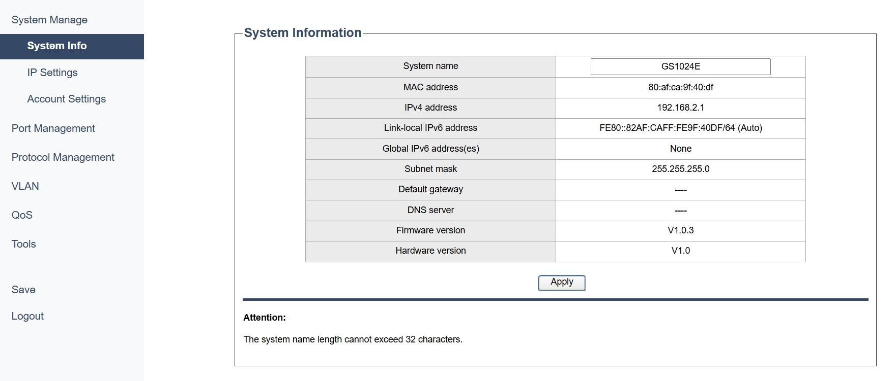

# System Manage

## System Info

- System name: The name assigned to the switch for identification purposes. You may customize it.
- MAC address: A unique identifier assigned to network interfaces for communications on the physical network segment.
- IPv4 address: The IP address assigned to the switch using the IPv4 protocol.
- Link-local IPv6 address: IPv6 address used for communication within the local network segment.
- Global IPv6 address(es): IPv6 addresses assigned to the switch for global communication over the internet.
- Subnet mask: A mask used to divide an IP address into two parts: the network part and the host part.
- Default gateway: The IP address of the router that the switch uses to forward packets to other networks.
- DNS server: The IP address of the server that translates domain names into IP addresses.
- Firmware version: The version of the software embedded in the switch's hardware.
- Hardware version: The version of the physical components of the switch.
  
*- Apply:* Click to save and apply your changes or settings.

---

## IP Settings

- DHCP settings: Select to **Enable** or **Disable** the settings of DHCP (Dynamic Host Configuration Protocol), which automatically assigns IP addresses to devices on the network.
- IP address: The IP address assigned to the device. It is 192.168.2.1 by default.You may customize this field when **DHCP settings** is **Disabled**.
- Subnet mask: A mask used to divide an IP address into two parts: the network part and the host part. It is 255.255.255.0 by default. You may customize this field when **DHCP settings** is **Disabled**.
- Default gateway: The IP address of the router that the device uses to forward packets to other networks.
- Auto DNS: Select to **Enable** or **Disable** the setting to automatically assign DNS server addresses.
- DNS server: The IP address of the server that translates domain names into IP addresses.

*- Apply:* Click to save and apply your changes or settings.

---

## Account Settings

- Username: The name used to log in to the switch management interface.
- Old password: Enter the current password for the user account.
- New password: Create a new password you want to set for the user account.
- Confirm password: Correctly re-enter the password you set for confirmation.

*- Apply:* Click to save and apply your changes or settings.

 The length of the usename and new password cannot be more than 16 characlers, and ony numbers, Engish lellers and underscores can be used.

