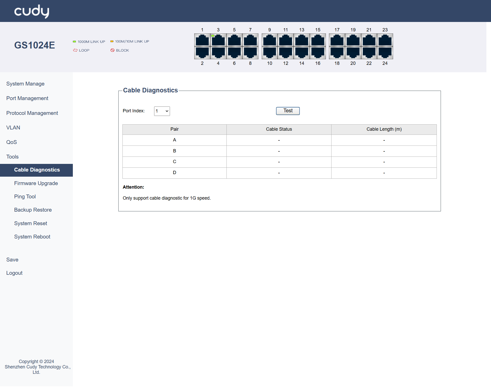
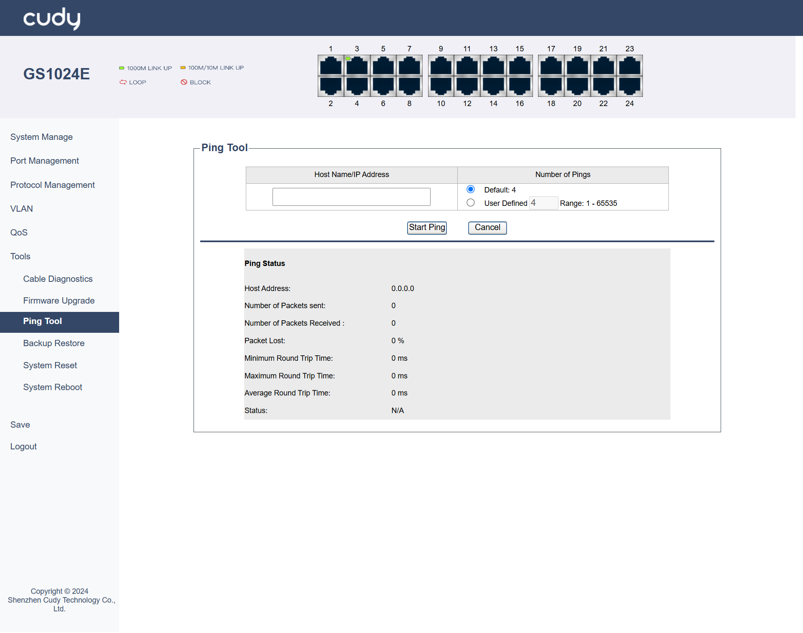
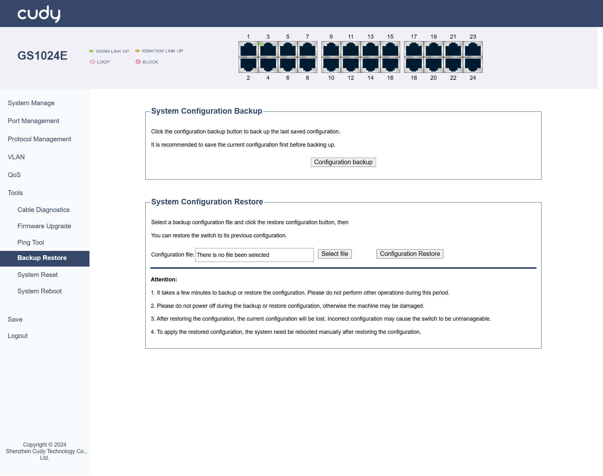
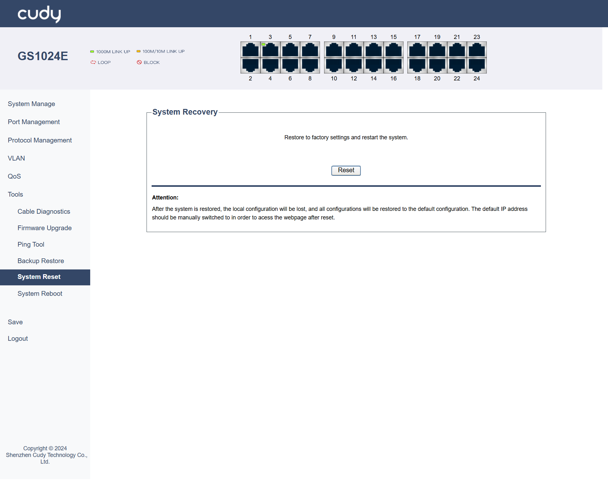
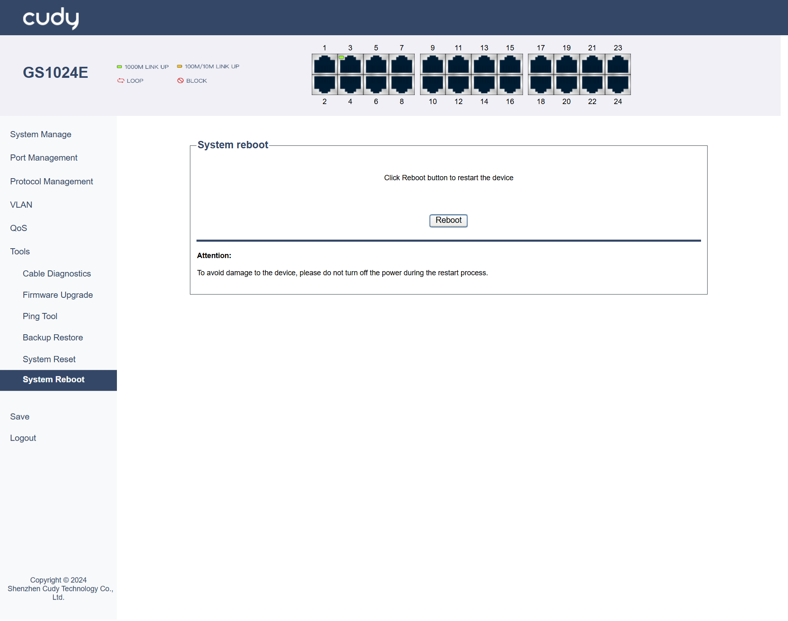

# Tools

## Cable Diagnostics
Supports to test and assess the condition of the cables connected to specific ports. 

- Port Index: Select the specific port on the switch to be tested.
- Test: Click to initiate the cable diagnostic test.
- Pair: Indicates which wire pair in the cable is being tested.
- Cable Status: Shows the condition of the cable.
- Cable Length (m): Displays the length of the cable in meters.

 Only support cable diagnostic for 1G speed.

---

## Firmware Upgrade
Updates the switch to its latest firmware, enhancing functionality, fixing bugs, or improving security.

*- Select file*: Click to locate and upload the firmware file to be upgraded.

*- Apply*: Click to start the firmware upgrading process.

<li>Do not power off during the process, otherwise the machine may be damaged.</li> 
<li>It is recommended to backup the current configuration before upgrading.</li> 

---

## Ping Tool
Tests connectivity to another device by sending ICMP echo requests and measuring the response time.

- Host Name/IP Address: Enter the destination address or hostname to which the ping packets will be sent.
- Number of Pings: Enter the number (between 1 to 65535) of ICMP echo requests to be sent to the specified host. Default number is 4.

*- Start Ping*: Click to start the Ping process.

*- Cancel*: Click to stop or clear the Ping process.

**Ping Status**

- Host Address: Displays the IP address of the host being pinged.
- Number of Packets sent: Displays the total number of ping packets sent to the host.
- Number of Packets Received: Displays the number of ping packets successfully received from the host.
- Packet Lost: Displays the number of ping packets that were not received, indicating potential network issues.
- Minimum Round Trip Time: Displays the shortest time taken for a ping packet to travel to the host and back.
- Maximum Round Trip Time: Displays the longest time taken for a ping packet to travel to the host and back.
- Average Round Trip Time: Displays the average time taken for all ping packets to travel to the host and back.
- Status: Indicates the overall result of the ping test：Ping in Progress, Ping Failed or Success.

---

## Backup Restore
Saves or retrieves switch configuration settings, allowing you to back up current settings or restore previous ones.

**System Configuration Backup**

*- Configuration backup*：Click to download and backup the configuration file.

**System Configuration Restore**

*- Select File*：Click to locate and upload the configuration file.

*- Configuration Restore*：Click to start the restore process.

---

## System Reset
Resets the switch to its factory default settings, erasing all custom configurations.

*- Reset*: Click to restore the factory settings and restart the system.

---

## System Reboot
Restarts the switch, reloading the current firmware and configuration without erasing settings.

*- Reboot*: Click to restart the switch.

 To avoid damage to the device, please do not turn off the power during the restart process.