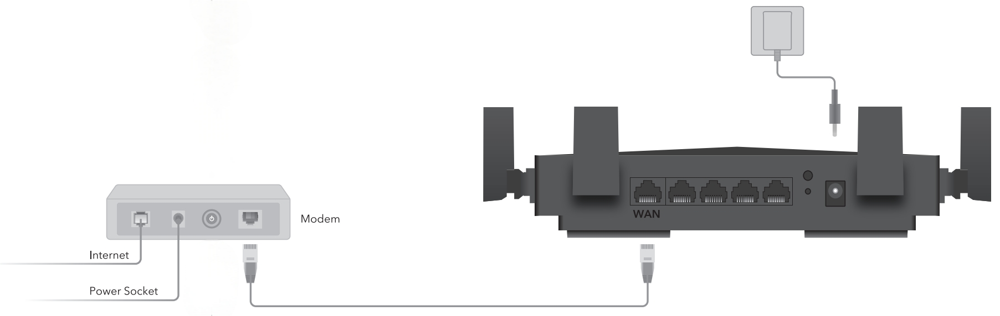

# Connection 
# - Position Your Router

- Generally, the Router is placed on a horizontal surface, such as on a shelf or desktop. The device also can be mounted on the wall.
- Place the Router in a location where it can be connected to multiple devices as well as to a power source.
- The Router can be placed on a shelf or desktop.
- Make sure the cables and power cord are safely placed out of the way so they do not create a tripping hazard.
- Keep the Router away from devices with strong electromagnetic interference, such as Bluetooth devices, cordless phones and microwaves.
- The product should not be located in a place where it will be exposed to moisture or excessive heat.

# - Connect Your Router

1. Connect the powered-off modem to the Router’s WAN port with an Ethernet cable.

2. Power on the modem, and then wait about 2 minutes for it to restart.
3. Connect the power adapter to the Router, and wait about 2-3 minutes for the system LED  to turn solid on.
4. Verify that the hardware connection is correct by checking the following LEDs.

5. Connect your device (computer or smart phone) to the Router.
    
    **Method 1 - With Ethernet Cable:** Turn off the Wi-Fi on your computer and connect it to the LAN port of the Router with an Ethernet cable.

    **Method 2 - Through Wi-Fi:** Click the network icon on your computer or go to Wi-Fi Settings on your smart device, and then select the SSID and input the password to join the network. (The default SSID and Password are on the bottom label of the Router).